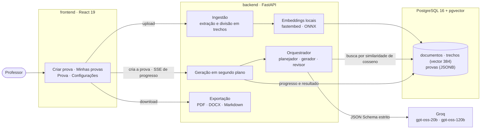
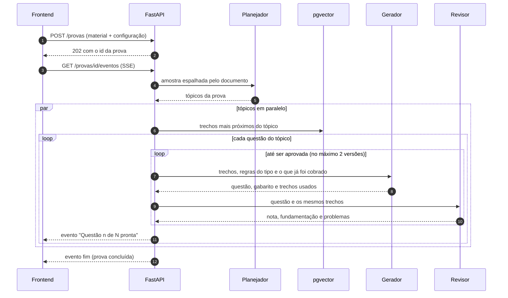

<p align="center">
  
</p>

<p align="center">
  <a href="https://github.com/KetlinOlliveira/ia-gerador-provas/actions/workflows/ci.yml"></a>
  
  
  
  
  
  
</p>

**PROVAI** transforma o material de aula do professor (PDF, Word ou texto) em uma prova
pronta, com questões de múltipla escolha, dissertativas e de verdadeiro ou falso, gabarito
comentado e critérios de correção.

Por trás da interface há um pipeline de **RAG** com embeddings locais e **pgvector**, e três
**agentes LLM** com papéis separados: um planeja os tópicos, outro escreve cada questão só com
os trechos recuperados do material, e um terceiro revisa. Questões reprovadas voltam para o
gerador com as críticas do revisor, e cada questão mostra de quais trechos do material saiu.

## Destaques

- **Questões fundamentadas no material.** O gerador recebe apenas os trechos recuperados por
  busca semântica e informa quais usou; a interface mostra esses trechos ao lado da questão.
- **Revisão com Reflection de verdade.** Um modelo maior avalia clareza, nível e
  fundamentação; a aprovação é decidida pelo código, e a questão reprovada é refeita
  recebendo os problemas apontados.
- **Saída estruturada e validada.** Cada agente devolve um modelo Pydantic: o provedor
  restringe a geração ao JSON Schema e as regras de negócio (como os critérios de correção
  somarem 10) são validadas e devolvidas ao modelo quando falham.
- **Progresso em tempo real.** A prova é gerada em segundo plano e a interface acompanha cada
  etapa por Server-Sent Events.
- **Histórico e exportação.** Busca, filtros e paginação no servidor; exportação em PDF, Word
  e Markdown, nas versões do aluno e do professor.
- **110 testes automatizados**: 81 no backend (com Postgres real) e 29 no frontend.

## Telas


<p align="center">
 </p>
<p align="center">
  
</p>
<p align="center">


</p>
<p></p>


## Arquitetura



### Como uma prova é gerada



| Agente | Modelo | O que faz |
|---|---|---|
| Planejador | `gpt-oss-20b` | Lê uma amostra espalhada pelo documento inteiro e define os tópicos da prova. |
| Gerador | `gpt-oss-20b` | Escreve questão e gabarito na mesma chamada, só com os trechos recuperados. |
| Revisor | `gpt-oss-120b` | Avalia clareza, dificuldade e se o gabarito é sustentado pelos trechos. |

Os modelos são configuráveis por papel no `.env`.

## Decisões técnicas

**Postgres com pgvector em vez de um banco vetorial separado.** Documentos, trechos, vetores
e provas ficam no mesmo banco. Documento e vetores são gravados na mesma transação, então não
existe documento sem vetores nem vetores órfãos, e a busca semântica é uma consulta SQL comum.
A primeira versão usava SQLite e ChromaDB e precisava de código para desfazer gravações quando
um dos dois falhava; esse código deixou de existir.

**Busca exata, sem índice HNSW.** A busca é sempre dentro de um documento, que tem algumas
centenas de trechos: percorrer todos é rápido e nunca perde resultado. Um índice aproximado
com filtro por documento pode devolver menos trechos que o pedido. O HNSW passa a valer quando
houver busca entre todos os documentos.

**Embeddings locais.** O modelo multilíngue `paraphrase-multilingual-MiniLM-L12-v2` roda em
ONNX via fastembed, sem custo, sem segunda chave de API e sem o material sair do servidor. Ele
vem embutido na imagem Docker. O tamanho dos trechos foi medido, não chutado: com 1000
caracteres cada trecho misturava assuntos e a busca errava; com 400, a pergunta sobre
autenticação passou a trazer o parágrafo de JWT em primeiro.

**Divisão em trechos que respeita frases.** Os trechos não cortam frases, compartilham a
última frase com o vizinho para não perder ideias na fronteira e guardam a página em que
começam, o que permite citar a página de cada fonte.

**Orquestração própria, sem LangChain.** O pipeline tem três agentes e um laço de revisão:
escrito à mão, ele fica pequeno, testável com um LLM falso e sem camadas de abstração entre o
código e o comportamento do modelo.

**Saída estrita por JSON Schema e validação com retorno ao modelo.** O provedor só deixa o
modelo gerar JSON que obedeça ao esquema. O que o esquema não expressa (critérios somando 10,
alternativas distintas, V/F misturando verdadeiras e falsas) fica nos validadores Pydantic;
quando um falha, o erro é devolvido ao modelo, que corrige a resposta.

**Questão e gabarito na mesma chamada.** O protótipo gerava o gabarito em outra chamada, sem o
material, e ele podia contradizer a questão. Agora os dois nascem juntos, com os mesmos trechos.

**A aprovação é do código, não do modelo.** O revisor devolve nota e se o gabarito tem base no
material; a questão só passa com nota mínima e fundamentada. Uma questão bem escrita, mas sem
base nos trechos, é refeita.

**Um modelo maior só para revisar.** Julgar se o gabarito está sustentado pelo material é a
tarefa mais difícil do pipeline, então o revisor usa um modelo maior; planejar e escrever usam
um menor e mais rápido.

**Letra correta sorteada.** Modelos tendem a colocar a resposta certa em A ou B; o orquestrador
sorteia a letra e a informa ao gerador.

**Geração em segundo plano com progresso no banco.** A API responde na hora e grava o
progresso no Postgres; o fluxo SSE lê de lá. Isso sobrevive a recarregar a página e permite
acompanhar a mesma prova de qualquer lugar. Como a tarefa roda no processo da API, uma prova
interrompida por reinício é marcada como falha na subida seguinte, em vez de ficar "gerando"
para sempre. Com mais de um processo, o próximo passo seria uma fila dedicada.

**Questões em JSONB.** As questões são sempre lidas junto com a prova, e o formato acompanha
os esquemas Pydantic sem uma migração a cada ajuste.

**Exportação a partir de blocos neutros.** A prova vira uma lista de blocos (título, questão,
item, gabarito) uma única vez; Markdown, DOCX e PDF só desenham esses blocos, então as três
versões nunca divergem no conteúdo.

**O material é tratado como dado, não como instrução.** Os trechos vão delimitados no prompt,
com a orientação de ignorar qualquer comando que apareça neles.

**Testes contra o banco real.** Os testes de API rodam num Postgres de verdade, migrado pelo
Alembic, com um LLM falso que responde conforme o esquema pedido. Assim o SQL, o pgvector e as
migrações são testados de fato, e a suíte não gasta tokens.

## Rodando localmente

Requer Docker com o Compose e uma chave gratuita da [Groq](https://console.groq.com/keys).

```bash
cp backend/.env.example backend/.env    # preencha GROQ_API_KEY
docker compose up --build
```

| Serviço | Endereço |
|---|---|
| Aplicação | http://localhost:5173 |
| API e documentação interativa | http://localhost:8010/docs |
| Postgres | `localhost:5442` (usuário, senha e banco: `provas`) |

As migrações rodam sozinhas quando o backend sobe, e o código dos dois serviços é montado nos
containers, então as alterações recarregam sem reconstruir as imagens. As portas do host podem
ser trocadas com `PORTA_FRONTEND`, `PORTA_API` e `PORTA_BANCO` num `.env` na raiz.

<details>
<summary>Rodando fora do Docker</summary>

Backend (requer [uv](https://docs.astral.sh/uv/) e o banco do compose no ar):

```bash
docker compose up -d db
cd backend
uv sync
uv run alembic upgrade head
uv run uvicorn app.main:app --reload --port 8010
```

Fora do Docker, o primeiro envio de documento baixa o modelo de embeddings (cerca de 240 MB)
para `backend/dados/modelos`.

Frontend:

```bash
cd frontend
npm install
npm run dev        # http://localhost:5173, repassando /api para a porta 8010
```

</details>

## Testes

```bash
# backend (81 testes, com o banco do compose no ar)
cd backend
uv run pytest
uv run ruff check .

# frontend (29 testes)
cd frontend
npm test
npm run lint
npm run typecheck
```

Os testes do backend criam e migram sozinhos um banco separado, `provas_testes`.

## API

| Método | Rota | Descrição |
|---|---|---|
| `POST` | `/api/v1/documentos` | Envia um `.txt`, `.pdf` ou `.docx`, que é dividido em trechos e indexado |
| `GET` | `/api/v1/documentos` | Lista os documentos enviados |
| `DELETE` | `/api/v1/documentos/{id}` | Remove o documento e seus trechos |
| `POST` | `/api/v1/documentos/{id}/busca` | Busca semântica nos trechos do documento |
| `POST` | `/api/v1/provas` | Cria uma prova e começa a gerá-la em segundo plano (responde 202) |
| `GET` | `/api/v1/provas/{id}/eventos` | Progresso da geração em tempo real (Server-Sent Events) |
| `GET` | `/api/v1/provas` | Histórico com busca, filtro de dificuldade, ordem e paginação |
| `GET` | `/api/v1/provas/estatisticas` | Total de provas e quantas foram criadas no mês |
| `GET` | `/api/v1/provas/{id}` | Prova completa: questões, gabarito, fontes e avaliação do revisor |
| `GET` | `/api/v1/provas/{id}/exportar` | Exporta em `pdf`, `docx` ou `md`, versão `aluno` ou `professor` |
| `DELETE` | `/api/v1/provas/{id}` | Remove a prova do histórico |
| `GET` | `/api/v1/sistema` | Modelos de cada agente e parâmetros do pipeline |

A documentação completa, com os esquemas de cada requisição, fica em `/docs` com a API no ar.

## Estrutura

```
backend/
  app/
    agentes/      planejador, gerador, revisor, orquestrador e prompts
    rag/          embeddings e busca semântica
    ingestao/     extração de texto (PDF, DOCX, TXT) e divisão em trechos
    llm/          cliente da Groq com saída estrita e validação
    servicos/     casos de uso: documentos, geração e ciclo de vida das provas
    exportacao/   PDF, DOCX e Markdown a partir de blocos neutros
    api/rotas/    rotas HTTP
    db/           modelos SQLAlchemy
  migracoes/      Alembic
  tests/
frontend/
  src/
    routes/       telas (TanStack Router, rotas por arquivo)
    components/   modal de progresso, menus e layout
    hooks/        geração com SSE
    api/          cliente e tipos da API
notebooks/        protótipo original feito no Google Colab
```

## Próximos passos

- Contas de usuário, com provas e materiais separados por pessoa.
- Uma avaliação automatizada da qualidade: um conjunto fixo de materiais para medir a taxa de
  aprovação de primeira, de questões refeitas e de questões sem base no material.
- Fila de tarefas dedicada, para rodar a geração fora do processo da API.
- Edição manual das questões antes de exportar.

## Origem

O projeto começou como um notebook no Google Colab, feito na faculdade, que está preservado em
[notebooks/](notebooks/). A reescrita trocou a geração a partir só do nome do tópico por RAG
sobre o material, a revisão "tenta de novo" por revisão com retorno das críticas, e o
notebook por uma aplicação completa com API, banco, interface e testes.
